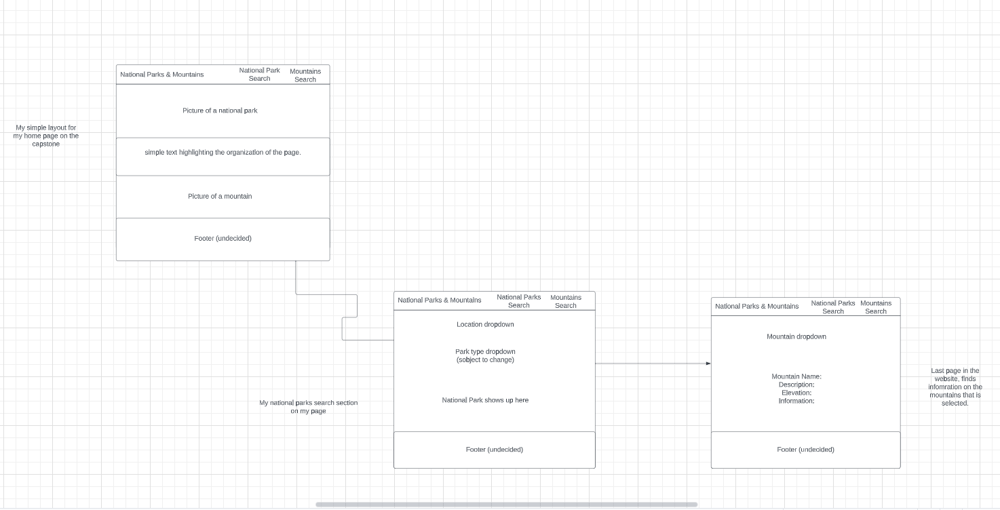
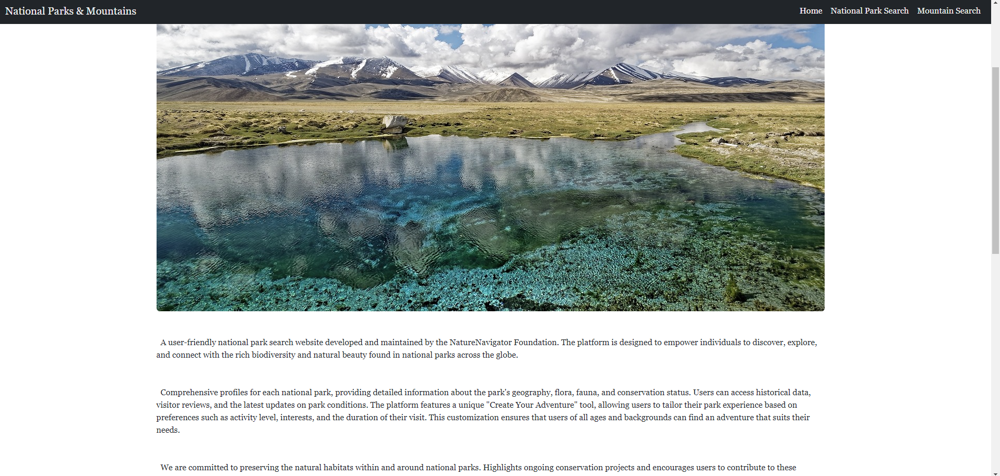
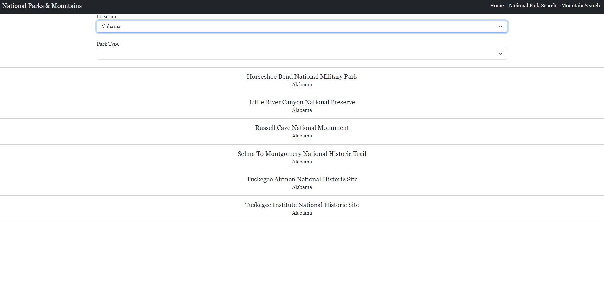
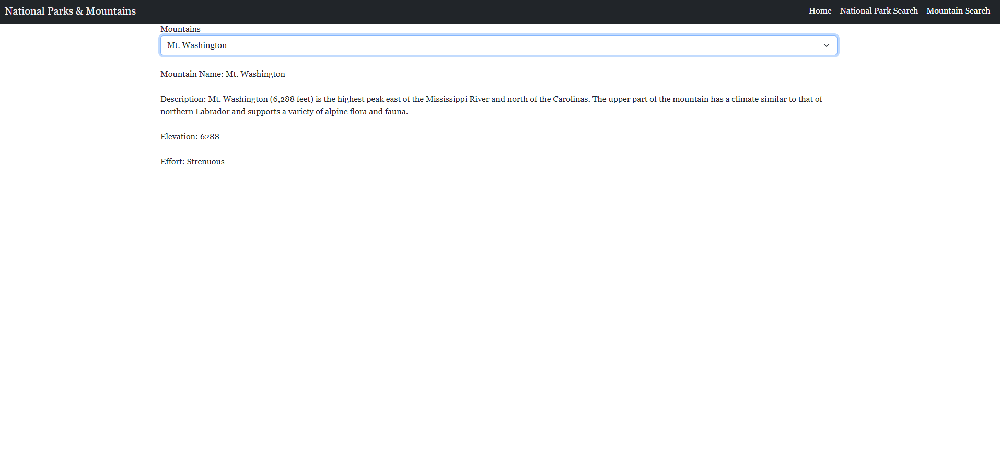

# capstone2

### Basic plan of page

### Home Page

* A very simple design that was done through HTML,CSS, and Bootstrap

### National Search Park Page

* This page was done through HTML and bootstrap
* The main part of this section was through JavaScript
* The JavaScript had to display dropdowns and be able to filter through park types

This part of the project made me lose my mind, to make it even worse I was sick throughout the whole project. When it came to present this part was not filtering the park types and displaying the outputs, to say the least it was a partially complete.

Thankfully I was able to make it work of course after the presentation. 

### Search Mountain Page

* This portion of the page was done through HTML, bootstrap, and JavaScript
* JavaScript being the main part of this section

I was able to complete the JavaScript without much trouble for this page. Finishing the portion made me believe I would be able to finish the other page, but I was completely wrong.

This whole project was one big lesson, how pride and embaressment do not matter and is the only thing holding you back, after all only you as an individual can hold yourself back.